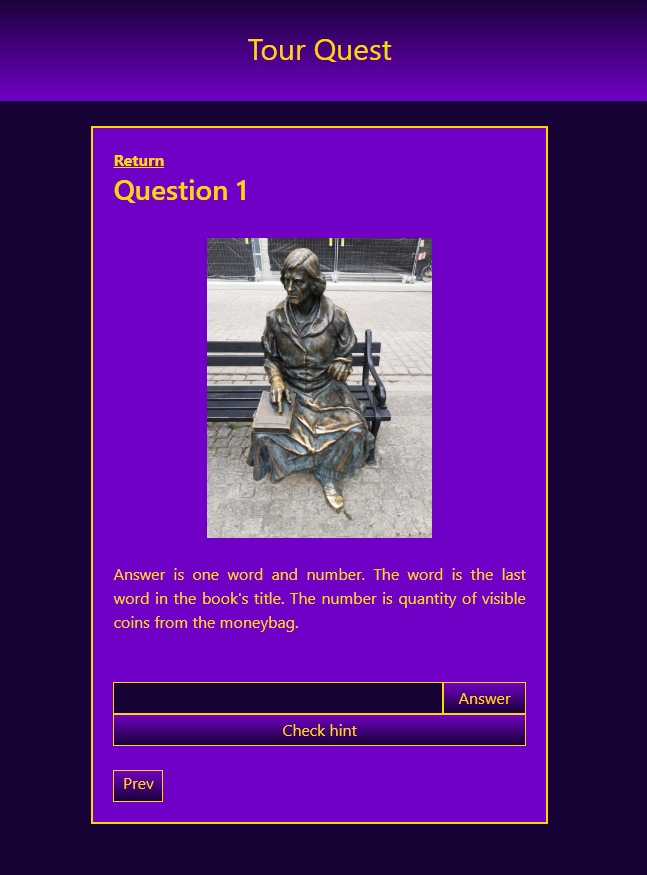

# TourQuest
Simple web touristic game offering creating stories and placing historical facts and riddles within scenarios.





### Note
Files like secrets or .env ABSOLUTELY SHOULD NOT be commited, but since this project was created only for the simple purpose of getting to know Flask or Docker, I took the liberty of instructing you on how to prepare example files:
* Go to ../TourQuest/
* Create folder secrets
* Go to ../TourQuest/secrets/
* Create file initdb.sql. Inside should be placed database structure:
```
CREATE TABLE users (
    id SERIAL PRIMARY KEY,
    user_login TEXT NOT NULL,
    user_password TEXT NOT NULL
);
```
* Create file pg_db. Inside should be placed chosen database name, for example:
```
database
```
* Create file pg_password. Inside should be placed chosen database password, for example:
```
password
```
* Create file pg_user. Inside should be placed chosen database username, for example:
```
username
```
* Go to ../TourQuest/
* Create .env file. Inside you should place
```
POSTGRES_HOST=db
POSTGRES_USER=username
POSTGRES_PASSWORD=password
POSTGRES_DB=database
```
Where after the "=" signs of the given variables (POSTGRES_USER, POSTGRES_PASSWORD, POSTGRES_DB) there should be strings of characters matching the contents of the corresponding files in the secrets folder.


### Clone Repository
```
git clone git@github.com:WojciechWlo/TourQuest.git
```

### Launching Project
```
docker compose up
```