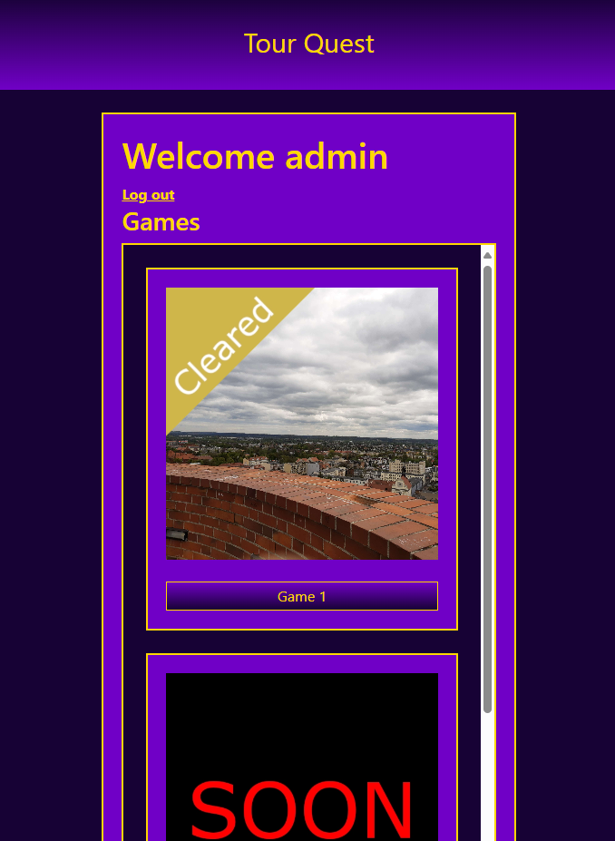

# TourQuest
Simple web touristic game offering creating stories and placing historical facts and riddles within scenarios.





### Note
Files like secrets or .env ABSOLUTELY SHOULD NOT be commited, but since this project was created only for the simple purpose of getting to know Flask and Docker, I took the liberty of instructing you on how to prepare example files:
* Go to ../TourQuest/
* Create folder secrets
* Go to ../TourQuest/secrets/
* Create file initdb.sql. Inside should be placed database structure:
```
-- Users table
CREATE TABLE Users (
    User_ID SERIAL PRIMARY KEY,
    Login TEXT NOT NULL,
    Password TEXT NOT NULL
);

-- Games table
CREATE TABLE Games (
    Game_ID SERIAL PRIMARY KEY,
    Name TEXT NOT NULL,
	PathToFile Text NOT NULL,
    Released BOOLEAN NOT NULL
);

-- Stage table
CREATE TABLE Stages (
    Stage_ID SERIAL PRIMARY KEY,
	Name TEXT NOT NULL,
    PathToFile TEXT NOT NULL
);

-- GameHasStage table
CREATE TABLE GameHasStage (
    ID SERIAL PRIMARY KEY,
    Game_ID INT,
    Stage_ID INT,
    FOREIGN KEY (Game_ID) REFERENCES Games(Game_ID),
    FOREIGN KEY (Stage_ID) REFERENCES Stages(Stage_ID)
);

-- NextStage table
CREATE TABLE NextStage (
    ID SERIAL PRIMARY KEY,
    Stage_ID INT,
    NextStage_ID INT,
    FOREIGN KEY (Stage_ID) REFERENCES Stages(Stage_ID),
    FOREIGN KEY (NextStage_ID) REFERENCES Stages(Stage_ID)
);

-- UserClearedStage table
CREATE TABLE UserClearedStage (
    ID SERIAL PRIMARY KEY,
    User_ID INT,
    Stage_ID INT,
    FOREIGN KEY (User_ID) REFERENCES Users(User_ID),
    FOREIGN KEY (Stage_ID) REFERENCES Stages(Stage_ID)
);


CREATE TABLE UserClearedGame (
    ID SERIAL PRIMARY KEY,
    User_ID INT,
    Game_ID INT,
    FOREIGN KEY (User_ID) REFERENCES Users(User_ID),
    FOREIGN KEY (Game_ID) REFERENCES Games(Game_ID)
);


-- Inserting data into the Games table
INSERT INTO Games (Name, PathToFile, Released) VALUES
('Game 1', 'games/game 1/game_1.json', True),
('Game 2', 'games/game 2/game_2.json', False),
('Game 3', 'games/game 3/game_3.json', False);

-- Inserting data into the Stages table
INSERT INTO Stages (Name, PathToFile) VALUES
('Stage 1', 'stages/stage_1.json'),
('Stage 2', 'stages/stage_2.json'),
('Stage 3', 'stages/stage_3.json'),
('Stage 4', 'stages/stage_4.json'),
('Stage 5', 'stages/stage_5.json');

-- Inserting data into the NextStage table
INSERT INTO NextStage (Stage_ID, NextStage_ID) VALUES
(3,4),
(1,2),
(2,3),
(null,1),
(4,5),
(5,null);

-- Inserting data into the GameHasStage table
INSERT INTO GameHasStage (Game_ID, Stage_ID) VALUES
(1,1),
(1,2),
(1,3),
(1,4),
(1,5);
```
* Create file pg_db. Inside should be placed chosen database name, for example:
```
database
```
* Create file pg_password. Inside should be placed chosen database password, for example:
```
password
```
* Create file pg_user. Inside should be placed chosen database username, for example:
```
username
```
* Go to ../TourQuest/
* Create .env file. Inside you should place
```
POSTGRES_HOST=db
POSTGRES_USER=username
POSTGRES_PASSWORD=password
POSTGRES_DB=database
```
Where after the "=" signs of the given variables (POSTGRES_USER, POSTGRES_PASSWORD, POSTGRES_DB) there should be strings of characters matching the contents of the corresponding files in the secrets folder.


### Clone Repository
```
git clone git@github.com:WojciechWlo/TourQuest.git
```

### Launching Project
```
docker compose up
```
